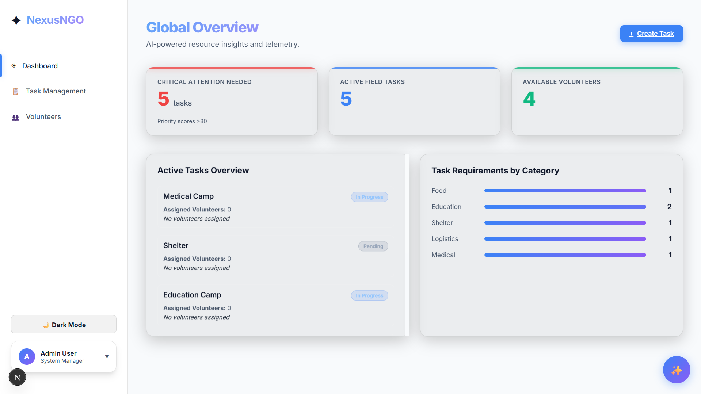
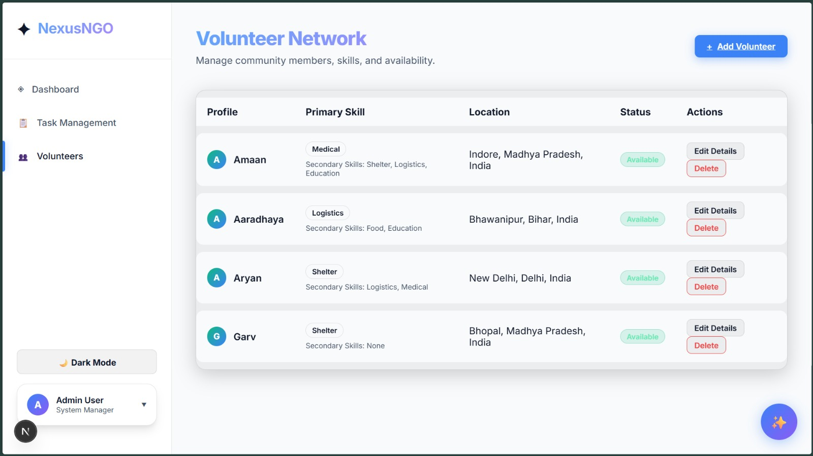
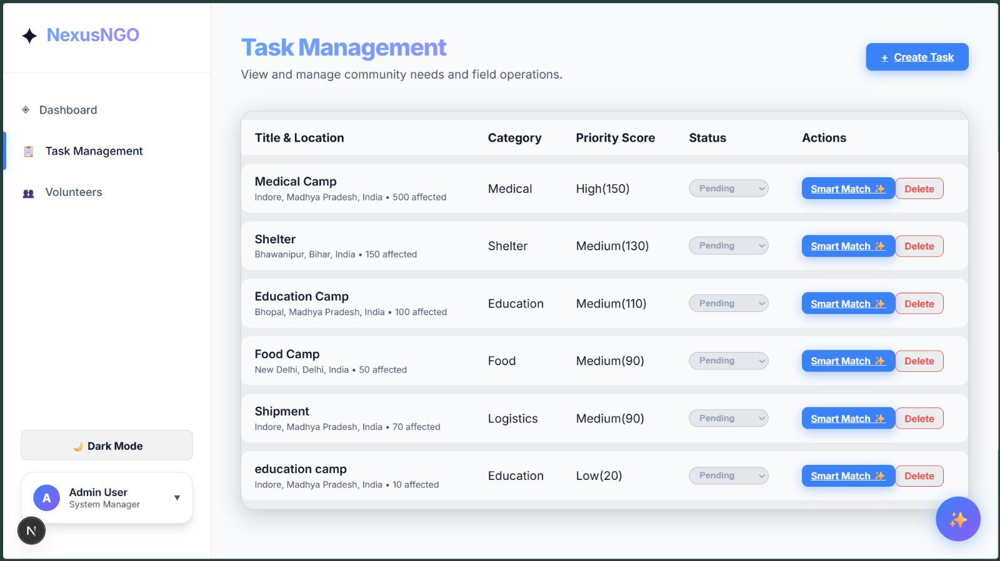
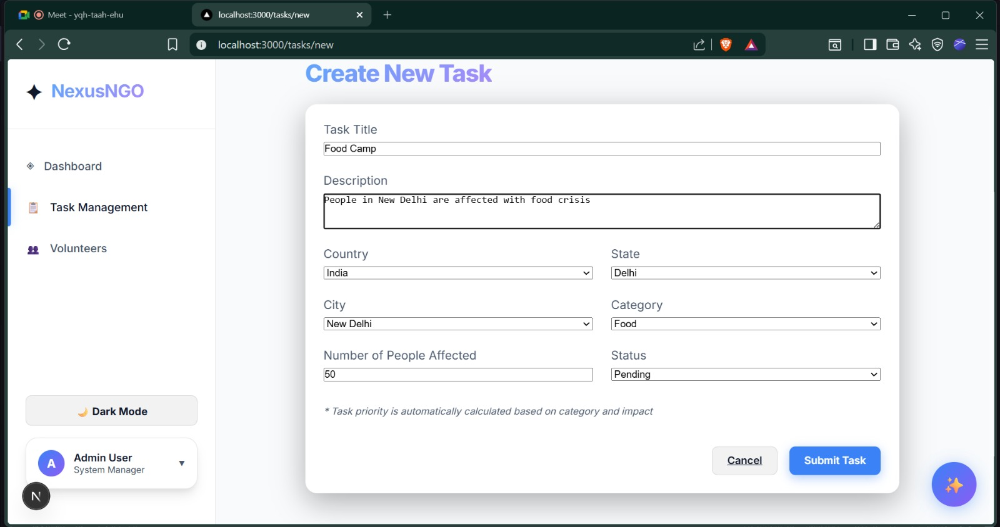
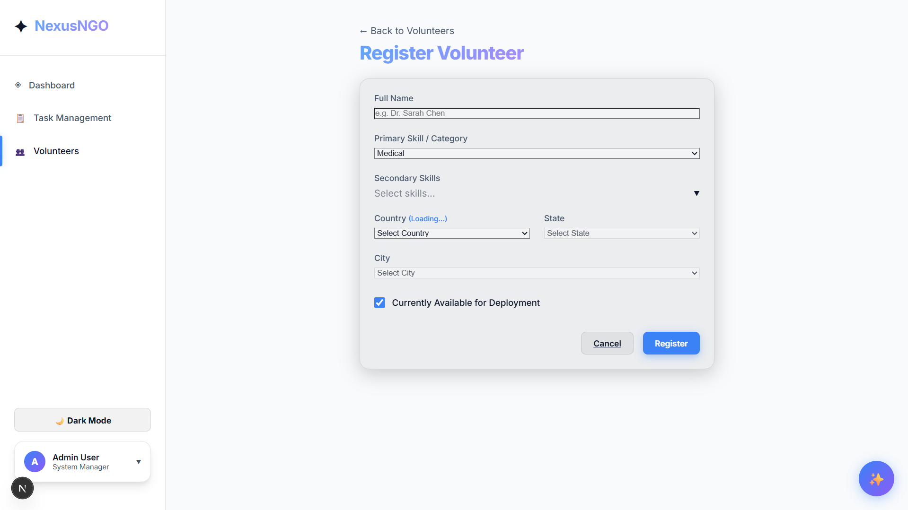

# 🚀 NexusNGO – Smart Resource Allocation System

A smart, data-driven platform designed to help NGOs efficiently manage volunteers and tasks, ensuring optimal resource allocation and faster response to critical needs.

---

## 📌 Problem Statement

Local NGOs and social organizations often struggle with:
- Poor coordination between volunteers and tasks
- Manual and inconsistent prioritization
- Scattered and unstructured data

This leads to inefficient use of resources and delayed response to critical situations.

---

## 💡 Solution

NexusNGO solves this problem by providing:
- Automated task prioritization
- Skill-based volunteer allocation
- Real-time task and resource tracking

---

## 🧠 Key Features

### 🔹 Smart Task Prioritization
- Automatically calculates priority based on:
  - Task category
  - Number of people affected
- Eliminates manual urgency input

---

### 🔹 Volunteer Management
- Add, edit, and remove volunteers
- Supports:
  - Primary skill
  - Secondary skills (multi-select)
- Tracks availability dynamically

---

### 🔹 Task Management
- Create and manage tasks
- Track:
  - Status (Pending / In Progress / Completed)
  - Priority score & label

---

### 🔹 Smart Matching System
- Matches volunteers based on:
  - Primary skills (higher weight)
  - Secondary skills (lower weight)
- Allows assigning multiple volunteers to a task

---

### 🔹 Real-Time Updates
- When a task is completed:
  - Assigned volunteers automatically become available again

---

### 🔹 Dashboard Overview
- Displays:
  - Active tasks
  - Volunteer availability
  - System insights for decision-making

---

## 🧮 Priority Calculation Logic

Priority is computed using:

```
Priority = Category Weight + Affected People Score
```

### Classification:
- 0 – 70 → Low  
- 71 – 140 → Medium  
- 141 – 150 → High  
- 150+ → Critical  

---

## 🖼️ Screenshots

### 📊 Dashboard


---

### 👥 Volunteer Management


---

### 📋 Task Management


---

### 🤖 Smart Matching


---

### ➕ Add Task


---

### ➕ Add Volunteer


---

## 🛠️ Tech Stack

### Frontend
- React / Next.js
- Tailwind CSS

### Backend
- Next.js API Routes

### Database
- JSON-based local database (for fast prototyping)

---

## ⚙️ Installation & Setup

```bash
# Clone the repository
git clone https://github.com/aaradhaya22/smart_resource_allocation.git

# Navigate to project folder
cd smart_resource_allocation

# Install dependencies
npm install

# Start development server
npm run dev
```

---

## 📁 Project Structure

```
/app
/components
/lib
/api
/db.json
```

---

## 🚀 Future Improvements

- Database integration (SQLite / MongoDB)
- Machine Learning-based prioritization
- Notification system
- Advanced analytics dashboard
- Better support in chatbot 
---

## 🤝 Contribution

Feel free to fork this repository and contribute!

---

## 📬 Contact

**Aaradhaya Dattole**  
GitHub: https://github.com/aaradhaya22  

---

## ⭐ Acknowledgement

This project was built as part of a hackathon to create impactful solutions for real-world problems.
